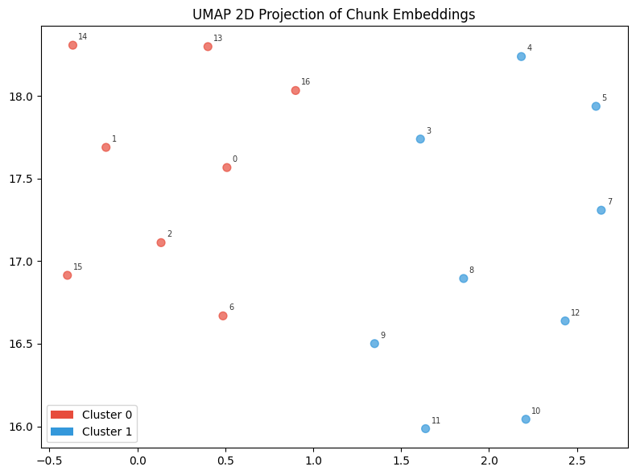
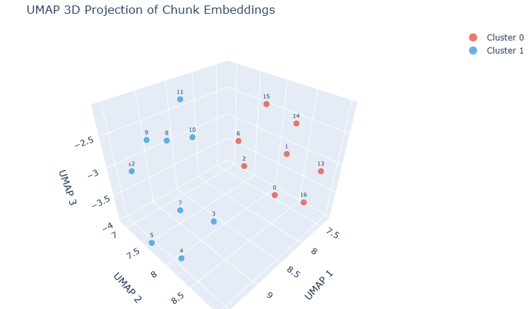

# Reproducible RAG Pipeline

> Created for the [SuperDataScience AI Challenge](https://www.skool.com/ai-challenge/about)

> **chunk → embed → reduce → cluster → visualize → store → retrieve**

A production-minded, reproducible Retrieval-Augmented Generation pipeline built from scratch in Python. Every stage of the pipeline is seeded with `RANDOM_STATE = 42` and architected around single-responsibility functions — making it easy to test, swap, and extend.

---

## Overview

This project walks end-to-end through the core mechanics of a RAG system:

- **Custom chunking** with natural boundary detection (paragraph → sentence → word)
- **Embedding** via OpenAI's `text-embedding-3-small`
- **Dimensionality reduction** via UMAP (2D & 3D) and PCA (strictly deterministic fallback)
- **Semantic clustering** via KMeans with LLM-generated cluster descriptions
- **Interactive visualization** with matplotlib (2D) and Plotly (3D)
- **Vector storage and retrieval** via ChromaDB with persistent storage

The demo document is the [Netflix Culture Memo](https://jobs.netflix.com/culture) — a rich, multi-topic document that makes cluster separation easy to inspect and reason about.

---

## Pipeline Architecture

```
Raw Text
   │
   ▼
┌─────────────────────────────────────┐
│  Step 1  │  chunk_text()            │  Natural boundary chunking (max 1000 chars, 50-char overlap)
└─────────────────────────────────────┘
   │
   ▼
┌─────────────────────────────────────┐
│  Step 2  │  embed_chunks()          │  OpenAI text-embedding-3-small → float vectors
└─────────────────────────────────────┘
   │
   ▼
┌─────────────────────────────────────┐
│  Step 3  │  reduce_to_2d/3d_*()     │  UMAP or PCA dimensionality reduction
└─────────────────────────────────────┘
   │
   ▼
┌─────────────────────────────────────┐
│  Step 4  │  cluster_embeddings()    │  KMeans clustering with seeded centroids
└─────────────────────────────────────┘
   │
   ▼
┌─────────────────────────────────────┐
│  Step 5  │  describe_cluster()      │  GPT-4o-mini summarizes each cluster's theme
└─────────────────────────────────────┘
   │
   ▼
┌─────────────────────────────────────┐
│  Step 6  │  plot_2d / plot_3d()     │  Matplotlib 2D + interactive Plotly 3D scatter
└─────────────────────────────────────┘
   │
   ▼
┌─────────────────────────────────────┐
│  Step 7  │  ChromaDB               │  PersistentClient → store → query top-k chunks
└─────────────────────────────────────┘
```

---

## Visualizations

### 2D UMAP Projection



The 2D scatter plot shows 17 text chunks from the Netflix Culture Memo projected into two dimensions via UMAP, then colored by KMeans cluster assignment. **Cluster 0** (red, left side) groups chunks covering Netflix's core cultural values — high performance, candor, respect, and organizational philosophy. **Cluster 1** (blue, right side) captures more operationally-focused content around policies, compensation, and day-to-day practices. The clean left/right separation confirms that the embeddings carry meaningful semantic signal even before clustering.

---

### 3D UMAP Projection



The interactive 3D view (rendered here as a static export) adds a third UMAP dimension, revealing additional depth in the cluster geometry. The two clusters remain clearly separable across all three axes, with Cluster 0 (red) consistently occupying the higher UMAP 1 range and Cluster 1 (blue) spread across the lower UMAP 2 / UMAP 3 plane. This view is particularly useful for spotting borderline chunks that appear merged in 2D but separate cleanly in 3D.

---

## Key Design Decisions

### Single-Responsibility Functions
Every function does exactly one thing. Chunking, embedding, reduction, clustering, and storage are fully decoupled — making each stage independently testable and replaceable.

### Reproducibility-First
All stochastic components are seeded through a single `seed_all(RANDOM_STATE)` call at pipeline entry. The project documents exactly *where* determinism breaks down (UMAP's `pynndescent` backend) and provides two explicit escape hatches:

| Strategy | Tradeoff |
|---|---|
| `reduce_to_2d_cached()` / `reduce_to_3d_cached()` | Runs UMAP once, caches `.npy` to disk — reloads on subsequent runs |
| `reduce_to_2d_pca()` / `reduce_to_3d_pca()` | Strictly deterministic; sacrifices some cluster visual separation |

### Natural Boundary Chunking
Rather than hard-splitting on character count, the chunker respects text structure at both the start and the end of a chunk. It searches backward from the right window boundary for 
the highest-priority natural break (part of AI Challenge), and forward from the left window 
boundary to the nearest space or text end, then skips the space to start with the next letter
character:

1. Paragraph boundary (`\n\n`)
2. Sentence boundary (`. `)
3. Word boundary (` `)

Small chunks below `min_size` are merged with neighbors rather than emitted as orphans.

### UMAP Determinism — Known Limitation
Even with `random_state=42` and `n_jobs=1`, UMAP can produce axially-shifted or reflected projections across runs. This is a known upstream issue caused by non-determinism in `pynndescent` (UMAP's ANN backend) and floating-point variability in the optimization loop. The caching strategy is the recommended mitigation.

---

## Stack

| Component | Library |
|---|---|
| Embedding | `openai` (text-embedding-3-small) |
| Dimensionality Reduction | `umap-learn`, `scikit-learn` (PCA) |
| Clustering | `scikit-learn` (KMeans) |
| 2D Visualization | `matplotlib` |
| 3D Visualization | `plotly` |
| Vector Store | `chromadb` (PersistentClient) |
| LLM Cluster Description | `openai` (gpt-4o-mini) |
| Env Management | `python-dotenv` |

---

## Quickstart

### 1. Clone and install dependencies

```bash
git clone https://github.com/BleenEngBlue/rag-pipeline.git
cd rag-pipeline
pip install openai python-dotenv numpy umap-learn scikit-learn matplotlib plotly chromadb
```

### 2. Add your OpenAI API key

```bash
# .env
OPENAI_API_KEY=sk-...
```

### 3. Run the pipeline

Open `rag-pipeline.ipynb` in Jupyter and run all cells, or execute the entry point directly:

```bash
jupyter nbconvert --to script rag-pipeline.ipynb
python rag-pipeline.py
```

---

## Retrieval Example

```python
# Embed your query with the same model used for chunks
response = client.embeddings.create(
    model="text-embedding-3-small",
    input=["days off"]
)
query_embedding = response.data[0].embedding

# Query ChromaDB for the top-3 most relevant chunks
results = collection.query(
    query_embeddings=[query_embedding],
    n_results=3
)
```

ChromaDB handles cosine similarity search over the stored embeddings and returns the most semantically relevant chunks along with their metadata.

---

## Project Structure

```
rag-pipeline/
├── rag-pipeline.ipynb   # Main notebook — fully executable top-to-bottom
├── .env                 # OPENAI_API_KEY (not committed)
├── chroma_db/           # ChromaDB persistent storage (auto-created on first run)
├── reduced_2d.npy       # UMAP 2D cache (auto-created, delete to re-run UMAP)
├── reduced_3d.npy       # UMAP 3D cache (auto-created, delete to re-run UMAP)
└── README.md
```

> **Note:** `chroma_db/`, `reduced_2d.npy`, `reduced_3d.npy`, and `.env` should all be added to `.gitignore`.

---

## Extending the Pipeline

This architecture is intentionally modular. Common extension points:

- **Swap the document** — replace the `document` string with any plain text corpus
- **Swap the chunker** — plug in a token-aware chunker (e.g., `tiktoken`-based) for production use
- **Swap the embedder** — any embedding model returning a float vector works; just match dimensions at retrieval time
- **Increase clusters** — adjust `n_clusters` in `cluster_embeddings()` for larger documents
- **Add a generation step** — pass retrieved chunks as context to a chat completion call to close the full RAG loop

---

## Attribution

This project was created for the **[SuperDataScience AI Challenge](https://www.skool.com/ai-challenge/about)**.

---
