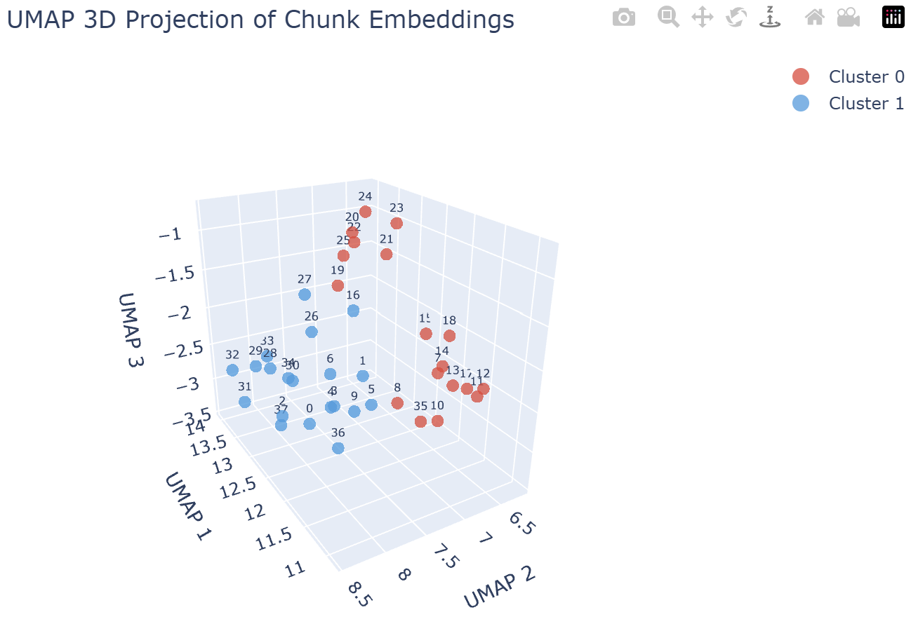

# RAG Scratchpad: Semantic Chunking & Embedding Visualization

A hands-on Jupyter notebook that walks through the core building blocks of a Retrieval-Augmented Generation (RAG) pipeline — from raw document ingestion through intelligent chunking, embedding generation, semantic clustering, and interactive 3D visualization.

The demo document is the [Netflix Culture Memo](https://jobs.netflix.com/culture) (June 2024).

---

## What This Notebook Does

The notebook is structured as a linear, step-by-step pipeline:

| Step | Description |
|------|-------------|
| **1. Setup** | Loads environment variables and initializes the OpenAI client |
| **2. Load Document** | Ingests the Netflix Culture Memo as a raw text string |
| **3. Chunk the Document** | Splits the text into overlapping chunks using natural language boundaries |
| **4. Generate Embeddings** | Calls OpenAI's `text-embedding-3-small` model to produce vector embeddings for each chunk |
| **5. Visualize in 2D** | Reduces embeddings to 2D with UMAP, clusters them with KMeans, and renders a static matplotlib scatter plot |
| **5b. Describe Clusters** | Sends each cluster's chunks to `gpt-4o-mini` to generate a short thematic description |
| **6. Visualize in 3D** | Renders an interactive, rotatable 3D Plotly scatter plot of the same embeddings |

---

## Chunking Strategy

The custom `chunk_text()` function prioritizes natural language boundaries in this order:

1. **Paragraph boundary** (`\n\n`)
2. **Sentence boundary** (`". "`)
3. **Word boundary** (`" "`)
4. **Hard cut** at `max_size` characters (fallback)

Small chunks below `min_size` are merged with adjacent chunks rather than emitted standalone. Chunks always begin at a word boundary — never mid-word.

**Default parameters:**
```python
chunk_text(text, max_size=500, overlap=50, min_size=250)
```

---

## Embedding Visualization

After generating embeddings, UMAP reduces the high-dimensional vectors to 2D (for a static plot) and 3D (for an interactive plot). KMeans (`k=2`) identifies two semantic clusters, which are color-coded and labeled by chunk index.

The 3D plot (shown below) reveals a clean separation between the two clusters, corresponding to distinct thematic groupings in the document — for example, people/culture topics vs. organizational principles.



---

## Requirements

```
openai
python-dotenv
numpy
matplotlib
umap-learn
scikit-learn
plotly
```

Install all dependencies:
```bash
pip install openai python-dotenv numpy matplotlib umap-learn scikit-learn plotly
```

---

## Setup

1. Clone this repo and navigate to the project directory.
2. Create a `.env` file in the project root with your OpenAI API key:
   ```
   OPENAI_API_KEY=your_key_here
   ```
3. Launch Jupyter and open the notebook:
   ```bash
   jupyter notebook RAG-plus-scratchpad.ipynb
   ```
4. Run all cells top to bottom.

---

## Models Used

| Model | Purpose |
|-------|---------|
| `text-embedding-3-small` | Generates vector embeddings for each text chunk |
| `gpt-4o-mini` | Describes the unifying theme of each semantic cluster |

---

## Key Concepts Demonstrated

- **Chunking with overlap** — avoids losing context at chunk boundaries
- **Semantic embeddings** — dense vector representations that capture meaning, not just keywords
- **Unsupervised clustering** — KMeans groups chunks by semantic similarity without labels
- **Dimensionality reduction** — UMAP makes high-dimensional embedding spaces human-interpretable
- **LLM-assisted interpretation** — using a language model to label and explain discovered clusters
