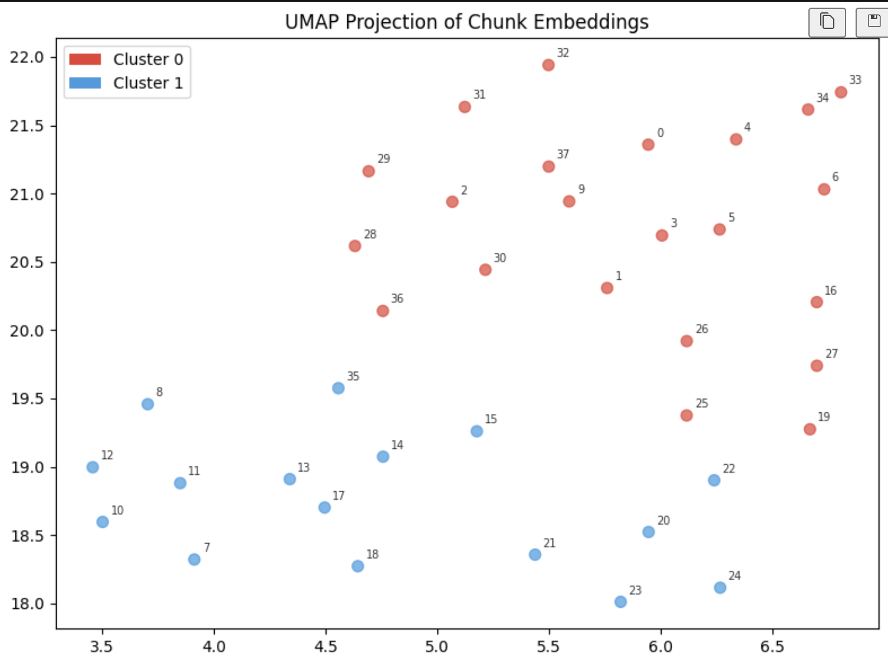
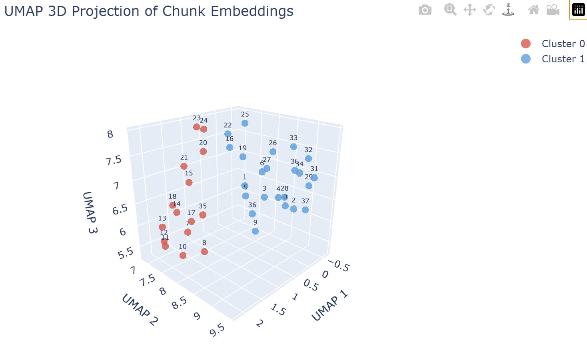

# RAG Pipeline — Reproducible Semantic Chunking, Embedding & Cluster Visualization

**End-to-end retrieval-augmented generation (RAG) preprocessing · Python · OpenAI API · scikit-learn**

A retrieval-augmented generation (RAG) preprocessing pipeline covering document ingestion, boundary-aware chunking, dense vector embedding, unsupervised clustering, and large language model (LLM)-assisted interpretation — built with an emphasis on the decisions that production deployments actually require. Every function does exactly one thing. Every source of randomness is seeded with `RANDOM_STATE = 42`.

**Stack:** `text-embedding-3-small` · `gpt-4o-mini` · KMeans clustering · UMAP dimensionality reduction · Principal Component Analysis (PCA - deterministic fallback) · Plotly 3D · matplotlib · NumPy · scikit-learn · python-dotenv · vector databases (Pinecone / Weaviate / pgvector) · natural language processing (NLP) · semantic search · information retrieval

---

## Pipeline

| Step | Stage | Description |
|------|-------|-------------|
| 01 | **Ingest** | Load & normalize raw text from source document |
| 02 | **Chunk** | Boundary-aware splitting with configurable overlap |
| 03 | **Embed** | 1536-dim dense vectors via `text-embedding-3-small` |
| 04 | **Reduce** | UMAP → 2D and 3D for visualization & inspection |
| 05 | **Cluster** | KMeans (k=2) on reduced embeddings |
| 06 | **Label** | `gpt-4o-mini` interprets each discovered cluster |

---

## Reproducibility

Chunking and clustering are fully deterministic across runs. UMAP dimensionality reduction may produce axially shifted or reflected projections run-to-run despite the fixed seed, due to non-determinism in `pynndescent` (UMAP's nearest-neighbor backend) and floating-point variability.

To get identical 2D and 3D plots across runs, use the cached variants `reduce_to_2d_cached()` and `reduce_to_3d_cached()`, or swap in `reduce_to_2d_pca()` / `reduce_to_3d_pca()` for strictly deterministic reduction.

All PRNGs (Pseudo-Random Number Generators) are fixed at the top of the pipeline:

```python
RANDOM_STATE: int = 42

def seed_all(seed: int = RANDOM_STATE) -> None:
    """Fix every PRNG that could affect the pipeline."""
    random.seed(seed)
    np.random.seed(seed)
    try:
        import torch
        torch.manual_seed(seed)
        torch.use_deterministic_algorithms(True)
    except ImportError:
        pass  # PyTorch not installed — nothing to seed
```

---

## Approach

The pipeline was designed around a few decisions that tutorial implementations tend to skip.

**Chunking** snaps to natural language boundaries — paragraphs first, then sentences, then words — rather than cutting at a fixed character count. A configurable `max_size` (default: 500 chars), `min_size` (default: 250 chars), and `overlap` (default: 50 chars) govern the process. Chunks that fall below `min_size` mid-document are merged forward as a prefix into the next window rather than emitted as isolated fragments — reducing short-chunk retrieval noise at query time. The advance logic always snaps the next start position to a word boundary, so chunks never begin mid-word. Several helper functions handle the edge cases directly:

- `find_natural_boundary` — tries paragraph breaks (`\n\n`), then sentence breaks (`. `), then word breaks (` `) within the current window, only accepting a cut if the resulting chunk meets the minimum size threshold
- `apply_boundary` — applies the cut and advances the end pointer past any mid-word position
- `handle_small_chunk` — merges sub-minimum chunks into the previous chunk if possible, or carries them forward as a prefix
- `advance_start` — computes the next window start with overlap, guarding against backward movement, and calls `snap_to_word_start` to guarantee clean boundaries

**Embedding quality validation** happens before the vector store sees any data. UMAP combined with KMeans clustering provides a practical sanity check: if the document's topics are not meaningfully separable in vector space, retrieval quality will suffer regardless of how prompts are written. Applied to the Netflix Culture Memo, the pipeline surfaces a clean two-cluster separation — organizational principles vs. people and culture themes — visible in both the 2D matplotlib scatter and the interactive 3D Plotly projection.

**2D UMAP projection** — static inspection of cluster separation with annotated chunk indices:



**3D UMAP projection** — interactive Plotly view that surfaces structure obscured in 2D:



**Cluster labeling** calls `gpt-4o-mini` with a structured system/user prompt, passing up to 10 chunks per cluster to stay within token limits. The task is short thematic summarization; the tradeoff favors low latency and cost over additional reasoning capacity. Output is post-processed with `textwrap.fill` and a terminal-width guard that safely falls back to 88 columns in notebook environments.

The embedding structure is compatible with production vector databases — Pinecone, Weaviate, and pgvector — without modification.

---

## Implementation Details

**Chunker parameters** (`chunk_text` function):

| Parameter | Default | Role |
|-----------|---------|------|
| `max_size` | 500 chars | Maximum chunk window |
| `overlap` | 50 chars | Context carried across chunk boundaries |
| `min_size` | 250 chars | Minimum chunk size before merge/carry-forward |

**Embedding API call:**

```python
response = client.embeddings.create(
    input=chunks,
    model="text-embedding-3-small"
)
embeddings = [item.embedding for item in response.data]
# Output: N × 1536 float vectors
```

**Dimensionality reduction — 2D (inspection) and 3D (interactive):**

```python
# 2D — matplotlib scatter with per-point index labels
reducer = umap.UMAP(n_components=2, random_state=RANDOM_STATE, n_jobs=1)
reduced_2d = reducer.fit_transform(embedding_matrix)

# 3D — Plotly Scatter3d with one trace per cluster for a clean legend
reducer = umap.UMAP(n_components=3, random_state=RANDOM_STATE, n_jobs=1)
reduced_3d = reducer.fit_transform(embedding_matrix)
```

`random_state` seeds UMAP's internal PRNG for initialization. Fixed `n_jobs=1` disables parallelism whose non-deterministic scheduling would otherwise cause slight numerical differences run-to-run.

**Cached UMAP reduction** (for identical plots across runs):

```python
CACHE_2D = Path("reduced_2d.npy")
CACHE_3D = Path("reduced_3d.npy")

def reduce_to_2d_cached(embedding_matrix: np.ndarray, seed: int = RANDOM_STATE) -> np.ndarray:
    """Reduce to 2D, loading from cache if available, saving on first run."""
    if CACHE_2D.exists():
        return np.load(CACHE_2D)
    reduced = umap.UMAP(n_components=2, random_state=seed, n_jobs=1).fit_transform(embedding_matrix)
    np.save(CACHE_2D, reduced)
    return reduced
```

Delete the `.npy` files whenever your chunks or embeddings change.

**PCA reduction** (strictly deterministic alternative, no caching needed):

```python
from sklearn.decomposition import PCA

def reduce_to_2d_pca(embedding_matrix: np.ndarray, seed: int = RANDOM_STATE) -> np.ndarray:
    """Strictly deterministic 2D reduction via PCA."""
    return PCA(n_components=2, random_state=seed).fit_transform(embedding_matrix)
```

PCA captures only linear variance, so cluster separation may appear less pronounced than UMAP. Prefer this when exact run-to-run reproducibility matters more than visual cluster spread.

**KMeans clustering:**

```python
kmeans = KMeans(n_clusters=2, random_state=RANDOM_STATE, n_init=10)
labels = kmeans.fit_predict(reduced)
```

`n_init=10` runs 10 independent centroid initializations to guard against local minima. `random_state` seeds centroid initialization so the same data always yields the same cluster assignments.

**LLM cluster labeling prompt structure:**

```python
messages=[
    {"role": "system", "content": "You are a helpful assistant that analyses and summarises groups of text chunks."},
    {"role": "user",   "content": f"Here are text chunks grouped by semantic similarity:\n\n{combined_text}\n\nIn 2–3 sentences, describe what topic or theme unites them."}
]
```

---

## UMAP Reproducibility — Known Quirk

Even with `random_state=42` and `n_jobs=1`, UMAP can still produce axially-shifted or reflected outputs run-to-run because:

1. UMAP's graph construction uses approximate nearest neighbors (via `pynndescent`), which has its own internal randomness that isn't always fully controlled by UMAP's `random_state`.
2. Floating-point non-determinism — small numerical differences in order of operations can compound through UMAP's optimization loop.
3. `pynndescent` version sensitivity — the degree of determinism you get from `random_state` varies by library version.

**The most reliable fix** is to cache the reduced embeddings to disk after the first run and reload them on subsequent runs, so UMAP only runs once (`reduce_to_2d_cached` / `reduce_to_3d_cached`). **A secondary option** — if you want to avoid disk I/O entirely — is to replace UMAP with PCA for dimensionality reduction, which is strictly deterministic (`reduce_to_2d_pca` / `reduce_to_3d_pca`).

---

## Model & Tool Selection

| Component | Choice | Reasoning |
|-----------|--------|-----------|
| Embeddings | `text-embedding-3-small` | 1536-dim, strong semantic fidelity at low cost — well-suited for retrieval at scale |
| Cluster labeling | `gpt-4o-mini` | Short summarization task; low latency and cost without meaningful quality loss |
| Dimensionality reduction | UMAP | Preserves local neighborhood structure better than PCA or t-SNE at this scale |
| Deterministic reduction | PCA | Strictly deterministic alternative when run-to-run plot identity matters more than cluster spread |
| Clustering | KMeans (scikit-learn) | Interpretable and fast; appropriate for k=2 with known cluster count |
| Visualization (2D) | matplotlib | Quick inspection of cluster separation with annotated chunk indices |
| Visualization (3D) | Plotly (`Scatter3d`) | Interactive and rotatable — surfaces structure that 2D projections can obscure |

---

## Getting Started

**1. Install dependencies**

```bash
pip install openai python-dotenv numpy umap-learn scikit-learn plotly matplotlib
```

**2. Configure API access**

Create a `.env` file in the project root:

```
OPENAI_API_KEY=your_key_here
```

**3. Run the notebook**

```bash
jupyter notebook rag_pipeline_reproducible_umap_kmeans_2d3d_plots.ipynb
```

Execute all cells top to bottom.

---

## Relevant to

| Role | Applicable work |
|------|----------------|
| AI / Applied ML Engineer | Custom boundary-aware chunker with merge logic and overlap; embedding pipeline; KMeans on reduced embeddings; 2D/3D dimensionality reduction with UMAP and PCA; caching strategies for reproducible projections; visual evaluation of vector space structure |
| AI Product Engineer | End-to-end RAG prototype on a real knowledge base (Netflix Culture Memo); configurable chunking parameters; tradeoff decisions on chunk size, overlap, and retrieval granularity; reproducibility-vs-visual-fidelity tradeoffs (UMAP vs. PCA) |
| LLM / Agent Engineer | Structured multi-step pipeline with LLM calls at defined stages; prompt design for cluster interpretation; model selection (embedding vs. chat) based on task requirements and cost/latency tradeoffs |
| Solutions / Forward-Deployed | Corpus-agnostic pipeline; embedding and retrieval architecture directly compatible with Pinecone, Weaviate, and pgvector; no modifications required for customer-specific deployments |

---

*Built for the [Super Data Science AI Challenge](https://www.skool.com/ai-challenge) · Knowledge base: [Netflix Culture Memo](https://jobs.netflix.com/culture)*
